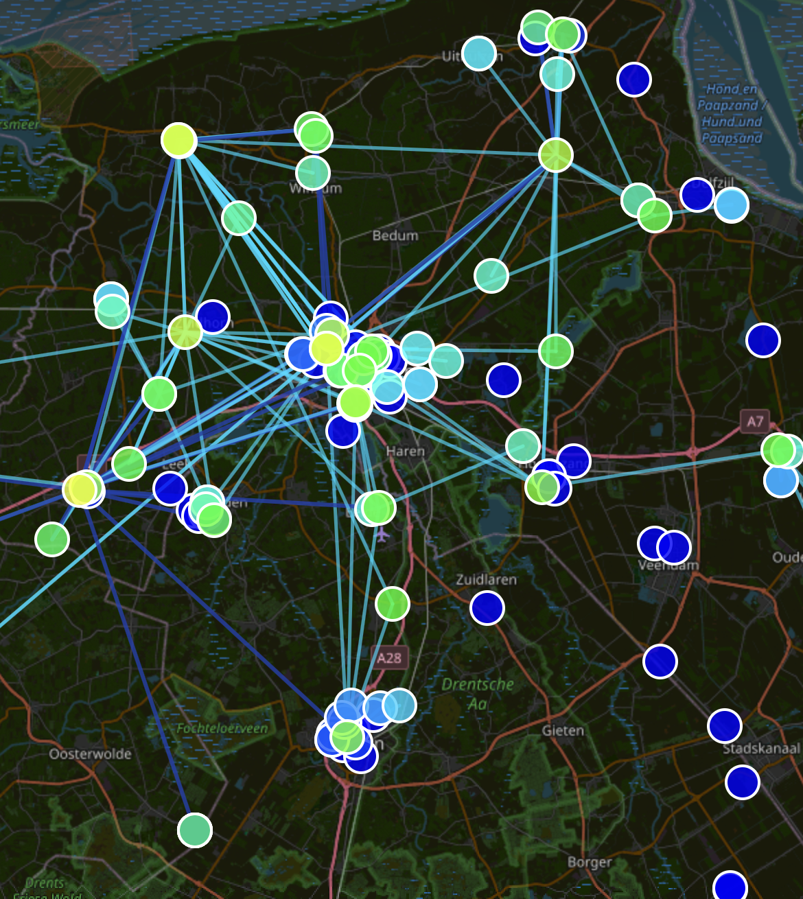
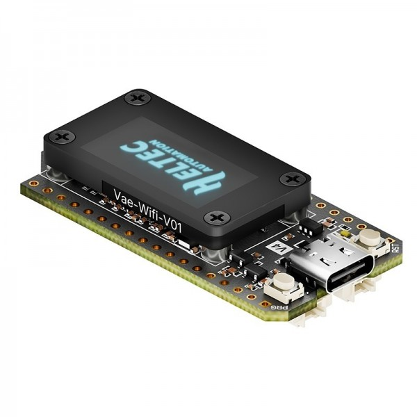
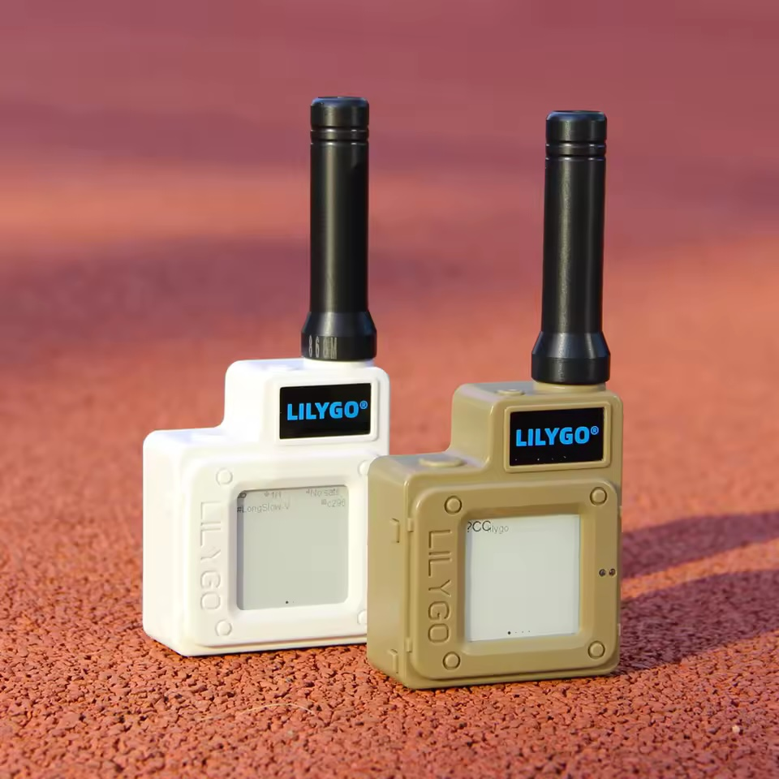
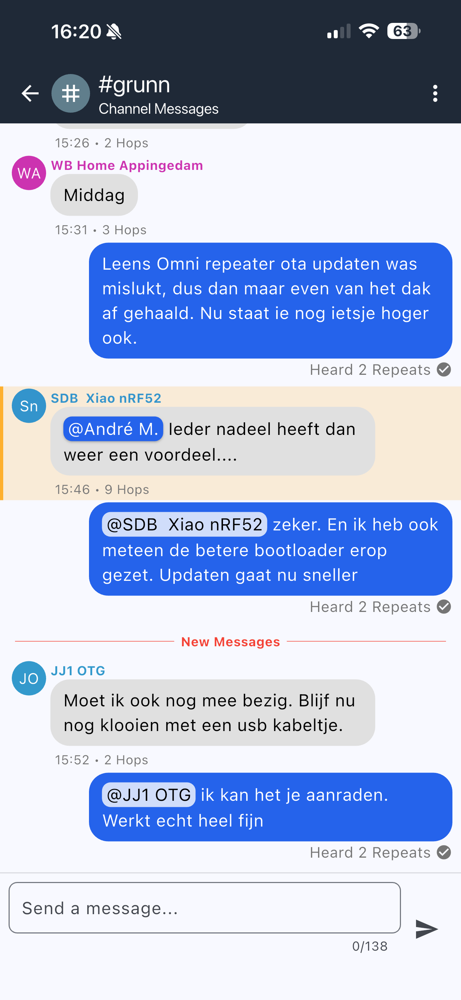
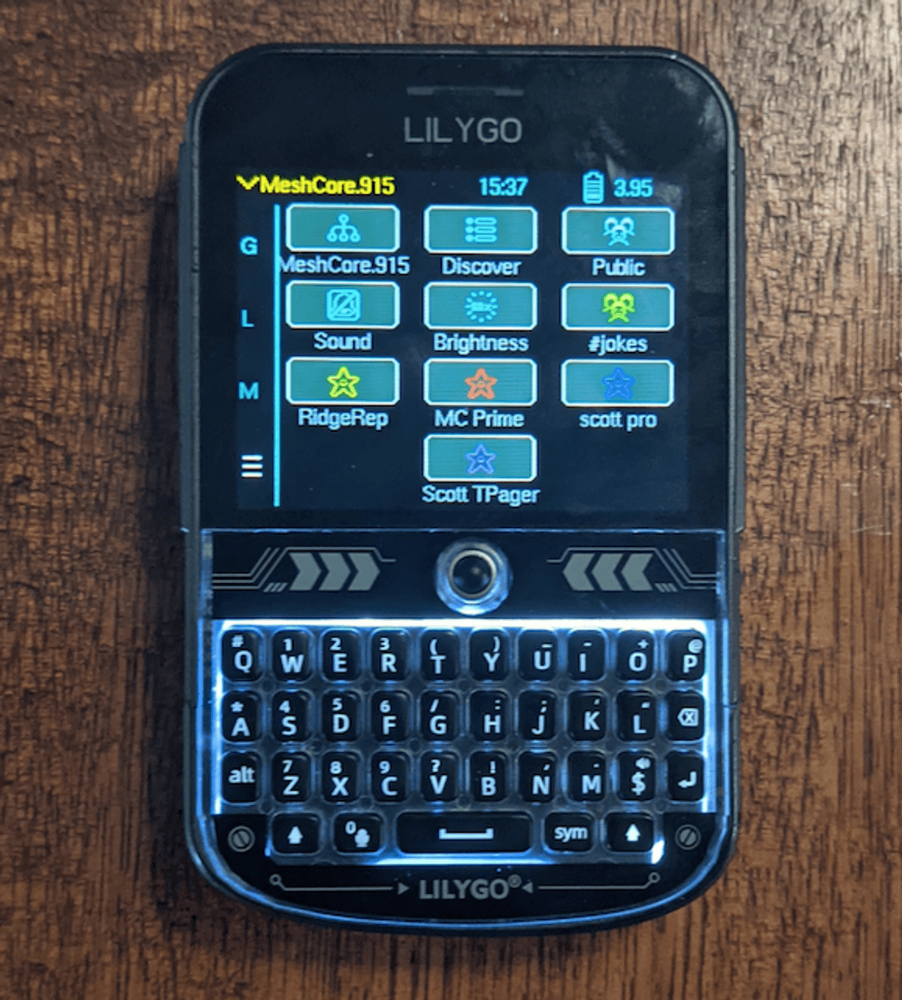
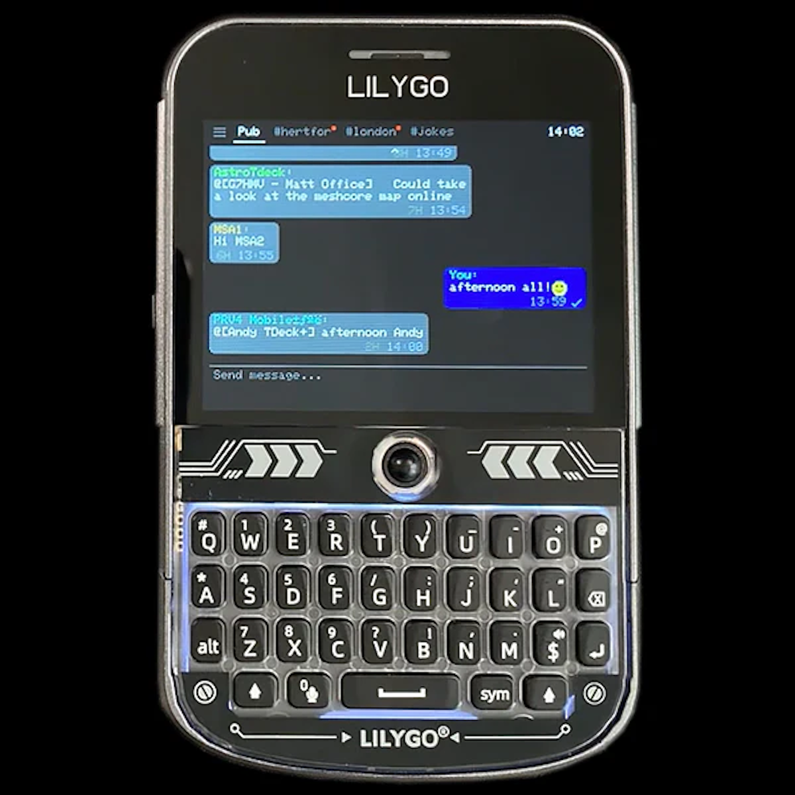
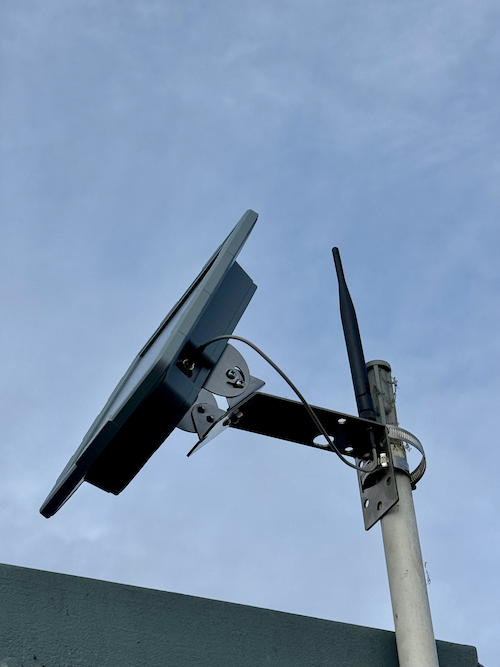

---
theme:
  name: gruvbox-dark
options:
  implicit_slide_ends: false
  h1_slide_titles: true
  end_slide_shorthand: true
---

<!-- alignment: center -->
<!-- newlines: 8 -->

Door: André Mathlener

---

# Wat is MeshCore?

<!-- column_layout: [2, 1] -->

<!-- column: 0 -->

## Algemeen

- Off-Grid berichten platform
- Gedecentraliseerd, geen internet nodig
- Laagdrempelig, geen licentie nodig
- Alle berichten zijn _versleuteld_
- _Kan_ gebruikt worden als nood-communicatie

## Manieren om te communiceren

- Kanalen
  - Public
  - `#grunn`, `#stad`, `#testnoord`
  - Privé Kanalen _(Private key nodig)_
- Direct Messaging
  - Zender en ontvanger moeten elkaar in het adresboek hebben
- Room Servers
  - Berichten worden opgeslagen op een server
  - Ontvangers kunnen berichten ophalen wanneer ze verbinding hebben

<!--column: 1 -->

<!-- newlines: 3 -->

---

# Hoe werkt het?

<!-- column_layout: [1, 1] -->

<!-- column: 0 -->

- Werkt met LoRa
  - In NL gebruiken we `EU/UK Narrow` preset
    - Frequency: **`869.618 MHz`**
    - Bandwidth: **`62.5 kHz`**
    - Spreading Factor: **`8`** _(snelheid)_
    - Coding Rate: **`8`** _(foutcorrectie)_

- Verschillende nodes maken samen een netwerk
  - Repeaters sturen alleen signalen door
  - Companions sturen direct naar elkaar of via repeaters

<!-- column: 1 -->

---

# Verschil met Meshtastic

<!-- column_layout: [1, 1] -->

<!-- column: 0 -->

## MeshCore

- Slimmere routering _(Path discovery)_
  - Zoekt en onthoudt de beste route voor elk bericht
- Betere betrouwbaarheid
  - Berichten komen vaker aan
- Companions _repeaten_ niet
  - Lager batterij verbruik

<!-- column: 1 -->

## Meshtastic

- Flood routing
  - Berichten worden overal heen gestuurd
- Minder betrouwbaar
  - Berichten kunnen verdwalen in drukke netwerken
- Cpmpanions _repeaten_ wel
  - Hoger batterij verbruik

<!-- reset_layout -->

> Doordat bij MeshCore steeds minder berichten aankwamen, zijn heel veel
> Meshtastic gebruikers overgestapt naar MeshCore.

---

# Welke Hardware?

<!-- column_layout: [1, 1] -->

<!-- column: 0 -->

## Companions

- **Heltec V3**
  - vanaf € 22,75
- **Heltec V4**
  - heeft een ingebouwde LNA
  - vanaf € 22,00
- **Heltec T114**
  - lager stroomverbruik
  - vanaf € 34,50
- LilyGo T-Echo
  - e-ink display, lager stroomverbruik
  - vanaf € 50,00
- **LilyGo T-Deck Plus**
  - geen telefoon nodig
  - vanaf € 95,00

<!-- column: 1 -->

---

# Welke Hardware?

<!-- column_layout: [1, 1] -->

<!-- column: 0 -->

## Telefoon

- Een iOS of Android telefoon met de MeshCore app is nodig om te communiceren met de Companions.
- De telefoon communiceert via **Bluetooth** met de Companion.

<!-- column: 1 -->

---

# Welke Hardware?

## Stand-alone Companions

- **LilyGo T-Deck Plus**
  - vanaf € 95,00
  - Geen telefoon nodig

<!-- column_layout: [1, 1] -->

<!-- column: 0 -->

<!-- column: 1 -->

---

# Welke Hardware?

<!-- column_layout: [1, 1] -->

<!-- column: 0 -->

## Solar Repeaters

- **Seeed Studio SenseCAP P1 Pro**
  - De beste keuze voor outdoor MeshCore repeaters.
  - Vanaf € 90
- **WisMesh Solar Repeater**
  - Compacte solar repeater van RAK Wireless
  - Vanaf € 95
- Zelfbouw
  - XIAO nRF52840 & Wio-SX1262 Kit - € 12,00
  - Action Solar Schijnwerper: € 18,95
  - 6 dBi Antenne van kalkanstore.nl: € 27,50
    - Totaal: € 58,45

<!-- column: 1 -->

---

# Is alles perfect?

<!-- pause -->

## Nee

<!-- pause -->

### Huidige problemen

- In het westen raakt het net overbelast
  - Sommige repeaters sturen veel te vaak adverts
  - Er zijn veel bots
- In het Noorden zijn er grote afstanden te overbruggen
- Direct Messages zijn niet altijd betrouwbaar
- Soms hebben we verbinding met de rest van NL, maar vaak is het éénrichtingsverkeer

<!-- pause -->

### Toekomstige verbeteringen

- Regio's
  - nl, nl-gr, nl-fr, nl-dr, etc ...
    - Gebruikers bepalen zelf in welke regio ze hun berichten willen zenden
    - Beheerders van repeaters kunnen bepalen welke regio's ze willen ondersteunen
- Andere instellingen
  - Spreading Factor 7 voor snelle berichten
- Nieuwe versie van het MeshCore protocol

---

# Spreading Factor test

<!-- pause -->

## Test 1: SF7

- Was in de Randstad een verbetering
  - Berichten kwamen sneller aan
  - Meer ruimte op het net
  - Bereik was iets kleiner
- In het Noorden deden te weinig mensen mee,
  - Leens was weer een eilandje geworden

<!-- pause -->

## Test 2: SF6

- Verbindingen waren nog sneller, maar bereik was nog kleiner

<!-- pause -->

## Voorlopige conclusie

- Spreading Factor 7 zou een goede verbetering kunnen zijn voor de Randstad
- Hopelijk redden we het in het Noorden hier ook mee
- Eventueel kunnen we _Bridges_ maken die berichten van SF7 naar SF8 kunnen doorsturen

---

# Tools: MeshCore Analyzer

---

# Tools: MC Radar

---

# Tools: MapMe.sh

---

# Leuke ervaringen: DX'en

---

# Leuke ervaringen: Aurora Borealis

---

# Leuke ervaringen: Vliegtuig
